<div align="center">

# Fluid Boutique 🛍️

### **THE LIQUID CURATOR**

A luxury e-commerce Flutter app built with Clean Architecture and BLoC — portfolio project targeting Flutter Developer internships.

<br/>


</div>

---

## 📸 Screenshots

<!-- Replace 'coming soon' with your actual screenshots -->

|                        Splash                         |                          Onboarding                          |                            Login                            |                            Sign Up                             | Forget Password                                                |
| :---------------------------------------------------: | :----------------------------------------------------------: | :---------------------------------------------------------: | :------------------------------------------------------------: | -------------------------------------------------------------- |
| 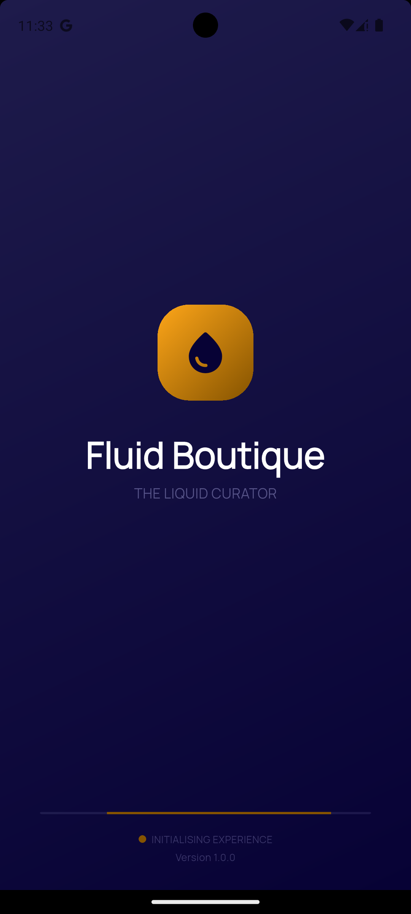 |  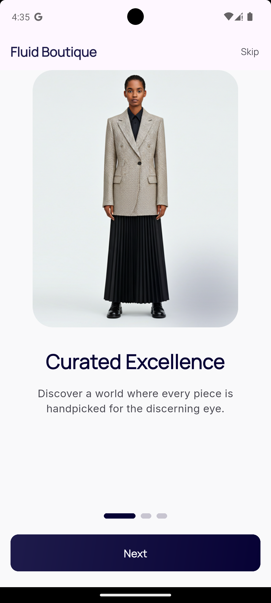   |    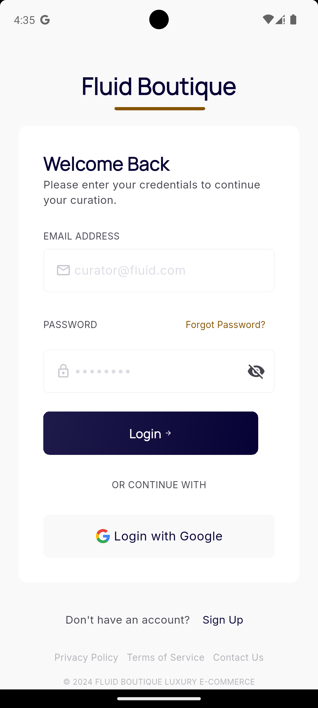     |     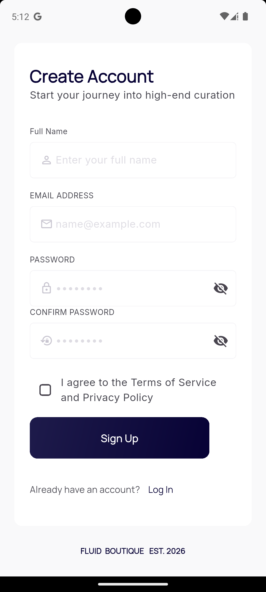      | 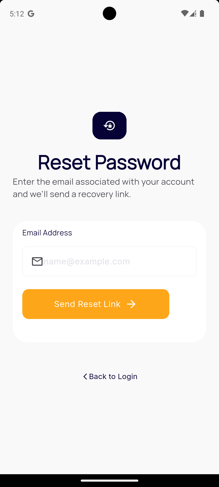 |
|                         Home                          |                            Search                            |                        All Products                         |                        Product Details                         |
|  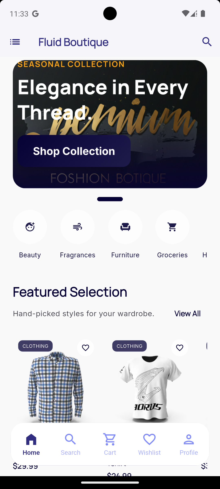  | 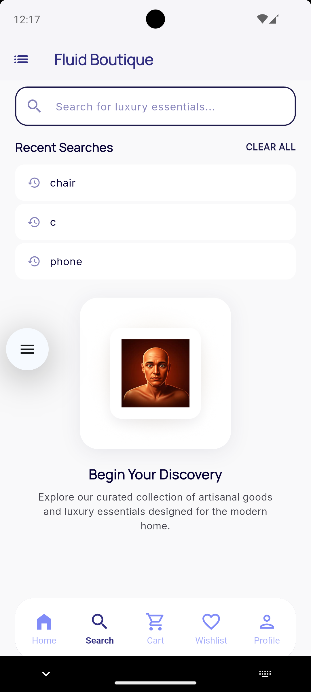 | 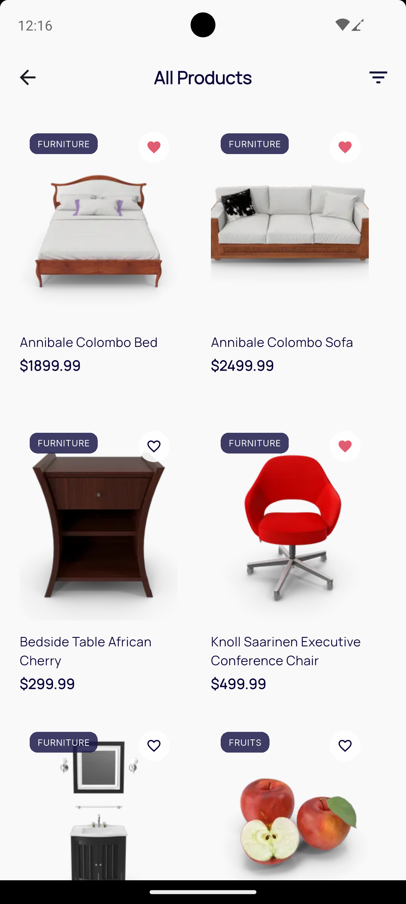 | 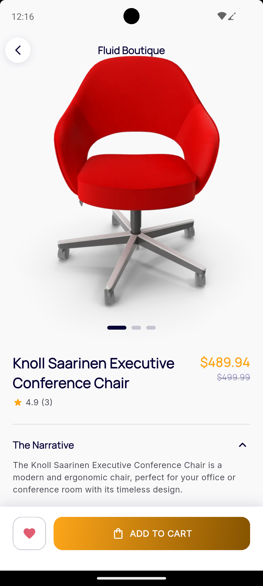 |

|                        Cart                         |                        Checkout                         |                        Wishlist                         |                        Orders                         |
| :-------------------------------------------------: | :-----------------------------------------------------: | :-----------------------------------------------------: | :---------------------------------------------------: |
| 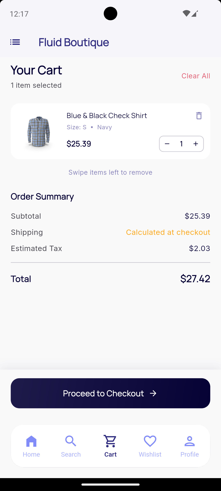 | 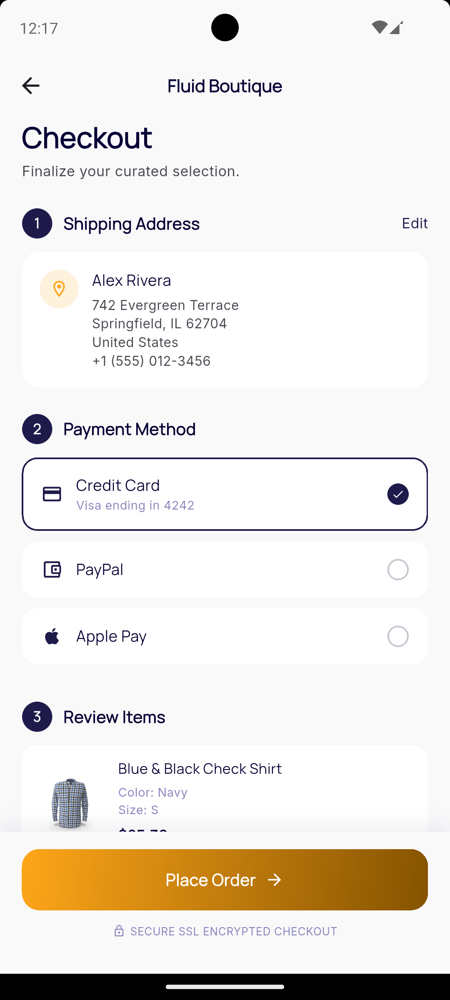 | 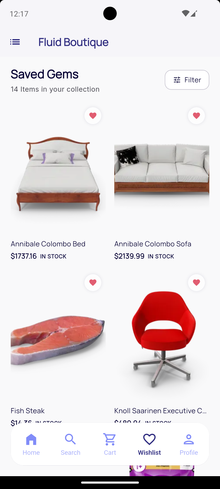 | 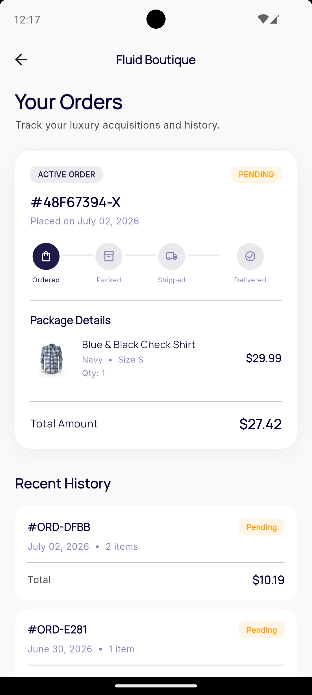 |

|                        Notifications                        |                        Profile                         |     |     |
| :---------------------------------------------------------: | :----------------------------------------------------: | --- | --- |
| 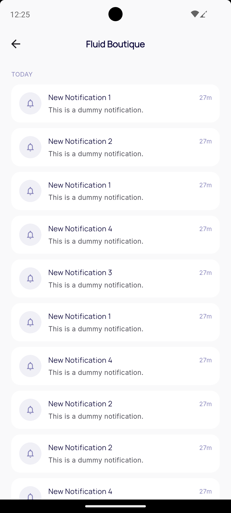 | 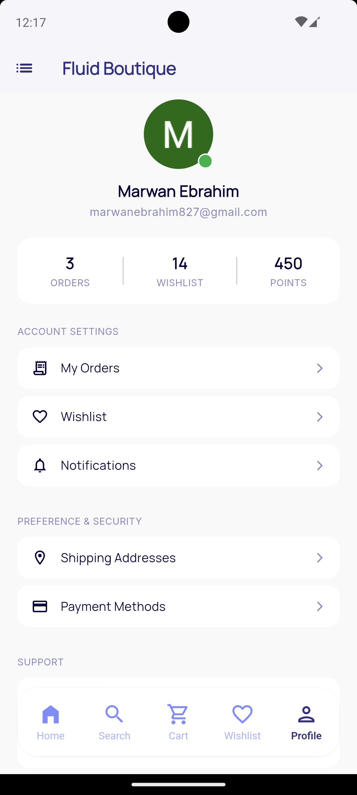 |     |     |

---

## ✅ Features

### User App

- [x] Splash Screen — animated loader + first-open detection (Hive)
- [x] Onboarding Flow — 3 screens, seen-once logic
- [x] Email + Password Login / Register
- [x] Google Sign-In
- [x] Forgot Password (Firebase email reset)
- [x] Home — Hero Carousel + Categories + Featured + New Arrivals
- [x] All Products — grid view with error/retry
- [x] Product Details — image carousel, color palette, size selector, specs, availability
- [x] Search — debounced API search (500ms) + local history (Hive)
- [x] Cart — add/remove/update quantity, swipe-to-delete, order summary
- [x] Checkout — shipping address, payment method, review items, place order
- [x] Wishlist — add/remove, persisted in Firestore, visible across all screens
- [x] Orders — active order with progress tracker + recent history
- [x] Notifications — Firestore-stored, grouped by Today/Yesterday/Earlier, mark as read
- [x] Profile — stats, account settings, logout with Google disconnect

---

## 🧱 Tech Stack

| Concern                | Technology                                        |
| ---------------------- | ------------------------------------------------- |
| Framework              | Flutter + Dart                                    |
| State Management       | BLoC                                              |
| Architecture           | Clean Architecture (Domain / Data / Presentation) |
| Backend                | Firebase (Auth + Firestore)                       |
| Products API           | [DummyJSON](https://dummyjson.com)                |
| Navigation             | `onGenerateRoute` — no GoRouter                   |
| Dependency Injection   | GetIt                                             |
| HTTP Client            | Dio (with BaseOptions + timeouts)                 |
| Local Storage          | Hive                                              |
| Functional Programming | dartz (`Either<Failure, T>`, `Unit`)              |
| Search Debounce        | RxDart (`debounceTime` + `switchMap`)             |
| Bottom Navigation      | liquid_glass_nav                                  |

---

## 🗂️ Project Structure

```
lib/
├── core/
│   ├── app strings/     → AppString (constants)
│   ├── configs/         → AppColors, AppTextStyles, AppTheme, CategoryIcons
│   ├── dialogs/         → AuthDialog
│   ├── error/           → Exceptions, Failures
│   ├── helpers/         → HiveHelper, ImageHelper
│   └── routing/
│       ├── app_router.dart
│       ├── app_routes.dart
│       └── args/        → AllProductsArgs, CheckoutArgs, ProductDetailsArgs
│
├── features/
│   ├── app/             → Splash + Onboarding (AppBloc)
│   ├── auth/            → Email + Google Auth (AuthBloc)
│   ├── products/        → Home + Search + All Products + Details
│   │                       (ProductBloc + SearchBloc)
│   ├── cart/            → Cart + Checkout (CartBloc)
│   ├── wishlist/        → Wishlist (WishlistBloc)
│   ├── orders/          → Orders + Place Order (OrdersBloc)
│   ├── notification/    → Notifications (NotificationBloc)
│   └── profile/         → Profile + Logout (ProfileBloc)
│
├── shared/widgets/      → CustomButtonWidget, CustomTextFormField, CustomErrorWidget
├── injection_container.dart
├── firebase_options.dart
└── main.dart
```

---

## 🏛️ Clean Architecture — Per Feature

```
feature/
├── data/
│   ├── datasources/   → API (Dio) / Firebase / Hive
│   ├── mapper/        → Model → Entity (Dart extension)
│   ├── model/         → JSON / Firestore parsing (fromMap / toMap)
│   └── repository/    → implements domain interface
├── domain/
│   ├── entity/        → Pure Dart classes, zero dependencies
│   ├── repository/    → Abstract interface
│   └── use_cases/     → Single responsibility, one call per use case
└── presentation/
    ├── bloc/          → Event / State / Bloc
    ├── screens/       → UI screens
    └── widgets/       → Feature-specific widgets
```

---

## 🔄 Error Handling Pattern

```
DataSource  ──throws──▶  Exception      (ServerException, CacheException)
Repository  ──catches──▶ Either<Failure, T>
BLoC        ──fold()───▶ emit State     (SuccessState / ErrorState)
UI          ──builds───▶ Widget         (content / error / loading)
```

### Exceptions (`core/error/exceptions.dart`)

`ServerException` · `CacheException` · `OfflineException`

### Failures (`core/error/failures.dart`)

`ServerFailure` · `CacheFailure` · `OfflineFailure`

---

## 🔥 Firestore Structure

```
users/
└── {userId}/
    ├── wishlist/
    │   └── {productId}/        ← one document per product
    │       ├── id, title, description, category
    │       ├── brand?, price, discountPercentage
    │       ├── rating, reviewsNumber, availabilityStatus
    │       └── images[], thumbnail, tags[]
    │
    └── cart/
        └── {productId}/        ← one document per product
            ├── ...product fields
            ├── quantity, color, size
            └── stock

orders/
└── {userId}/
    └── userOrders/
        └── {orderId}/          ← one document per order (subcollection)
            ├── userId, status, total, createdAt
            └── items[]         ← embedded list (one read = full order)

notifications/
└── {userId}/
    └── userNotifications/
        └── {notifId}/          ← one document per notification
            ├── title, body, type
            ├── imageUrl?, isRead, createdAt
            └── (type: "order" | "promo" | "exclusive")
```

---

## 🔍 Search — How It Works

```
TextField.onChanged
       │
       ▼
SearchBloc.add(SearchProductsEvent)
       │
       ▼  debounceTime(500ms)  ◀── waits for user to stop typing
       │
       ▼  switchMap            ◀── cancels in-flight request if user types again
       │
       ▼
GET /products/search?q={query}
       │
       ├── results → SearchSuccessState
       ├── empty   → SearchEmptyState
       └── error   → SearchErrorState

Search history stored in Hive, shown when search bar is empty.
```

---

## 💉 Dependency Injection — GetIt

| Type       | Registration            | Why                       |
| ---------- | ----------------------- | ------------------------- |
| DataSource | `registerLazySingleton` | One shared instance       |
| Repository | `registerLazySingleton` | One shared instance       |
| UseCase    | `registerLazySingleton` | Stateless — safe to share |
| BLoC       | `registerFactory`       | New instance per screen   |

**Registration order — always: DataSource → Repository → UseCase → BLoC**

---

## 🧭 Navigation Rules

| Scenario                           | Method                                       |
| ---------------------------------- | -------------------------------------------- |
| New screen with own BLoC           | `BlocProvider` in `onGenerateRoute`          |
| Screen that shares AppWrapper BLoC | `BlocProvider.value` in `onGenerateRoute`    |
| Multiple BLoCs needed              | `MultiBlocProvider`                          |
| After login                        | `pushReplacementNamed` (no back to auth)     |
| After place order                  | `pushNamedAndRemoveUntil` to Orders          |
| After logout                       | `pushNamedAndRemoveUntil` (clear all routes) |

---

## 🔑 Setup

**1. Clone**

```bash
git clone https://github.com/your-username/fluid-boutique.git
```

**2. Install dependencies**

```bash
flutter pub get
```

**3. Firebase Setup**

```
1. Create a Firebase project at console.firebase.google.com
2. Enable Authentication (Email/Password + Google)
3. Create Firestore database
4. Download and add:
   Android → android/app/google-services.json
   iOS     → ios/Runner/GoogleService-Info.plist
5. Run: flutterfire configure
```

**4. Run**

```bash
flutter run
```

---

## 📦 Key Dependencies

```yaml
# ui packages
google_fonts: ^8.0.2
smooth_page_indicator: ^2.0.1
flutter_svg: ^2.2.4
liquid_glass_nav: ^1.0.1
# state management packages
flutter_bloc: ^9.1.1
equatable: ^2.0.8
# Network packages
dio: ^5.9.2
# functional programming packages
dartz: ^0.10.1
# dependency injection
get_it: ^9.2.1
# local storage packages
hive: ^2.2.3
hive_flutter: ^1.1.0
# firebase packages
firebase_core: ^4.7.0
firebase_auth: ^6.4.0
cloud_firestore: ^6.3.0
# social media packages
google_sign_in: ^7.2.0
# utils packages
rxdart: ^0.28.0
intl: ^0.20.3
uuid: ^4.5.3
```

---

## 👤 Developer

## **Marwan Ebrahim** — Junior Flutter Developer

## 📄 License

For portfolio and educational purposes.
